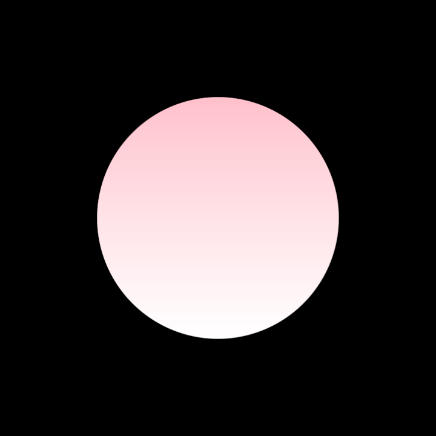
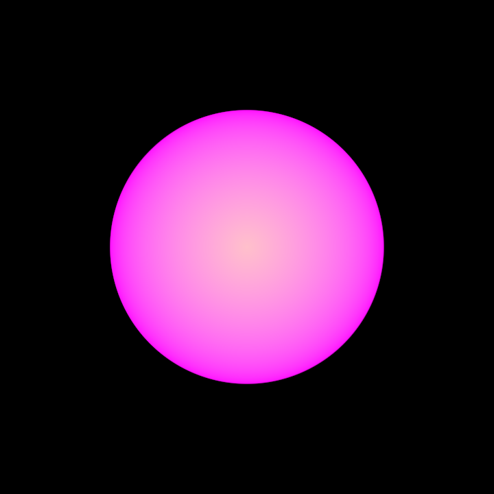
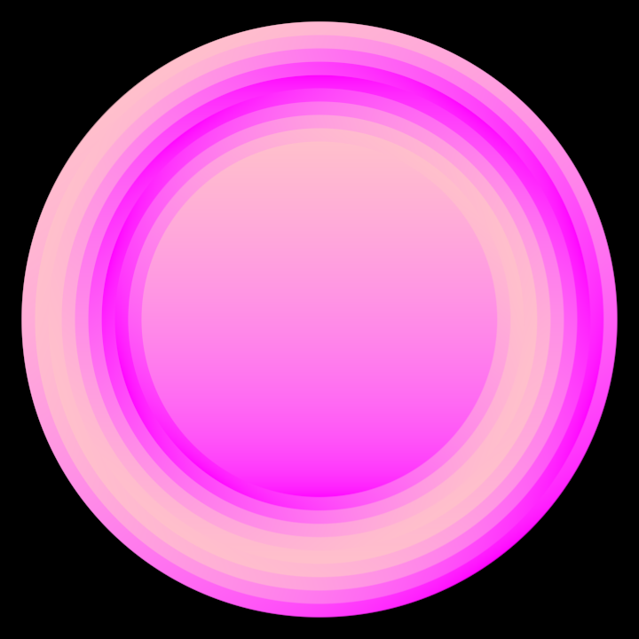

---
# File generated by dokgen. Do not edit. 
# Edit 'src/main/kotlin/docs/20_Colors/C300_Gradients.kt' instead.
layout: default
title: Gradients
parent: Colors
last_modified_at: 2025.02.20 16:30:45 +0000
nav_order: 300
has_children: false
---
 
# Gradients in OPENRNDR

In OPENRNDR gradients are implemented using shade styles.
 
 
## Linear gradients
 
 
 
 
```kotlin
fun main() = application {
    configure {
        width = 720
        height = 720
    }
    program {
        extend {
            drawer.shadeStyle = linearGradient(ColorRGBa.PINK, ColorRGBa.WHITE)
            drawer.circle(drawer.bounds.center, 200.0)
        }
    }
}
``` 
 
[Link to the full example](https://github.com/openrndr/openrndr-examples/blob/master/src/main/kotlin/examples/20_Colors/C300_Gradients000.kt) 
 
## Radial gradients
 
 
 
 
```kotlin
fun main() = application {
    configure {
        width = 720
        height = 720
    }
    program {
        extend {
            drawer.shadeStyle = radialGradient(ColorRGBa.PINK, ColorRGBa.MAGENTA)
            drawer.circle(drawer.bounds.center, 200.0)
        }
    }
}
``` 
 
[Link to the full example](https://github.com/openrndr/openrndr-examples/blob/master/src/main/kotlin/examples/20_Colors/C300_Gradients001.kt) 
 
## Linear gradients with rotation
 
 
 
 
```kotlin
fun main() = application {
    configure {
        width = 720
        height = 720
    }
    program {
        extend {
            drawer.stroke = null
            for (i in 9 downTo 0) {
                drawer.shadeStyle = linearGradient(ColorRGBa.PINK, ColorRGBa.MAGENTA, rotation = i * 36.0)
                drawer.circle(drawer.bounds.center, 200.0 + i * 15.0)
            }
        }
    }
}
``` 
 
[Link to the full example](https://github.com/openrndr/openrndr-examples/blob/master/src/main/kotlin/examples/20_Colors/C300_Gradients002.kt) 
 
## Linear gradients with animated rotation
 
 
<video controls preload="none" loop poster="../media/gradients-004-thumb.jpg">
    <source src="../media/gradients-004.mp4" type="video/mp4">
</video>
 
 
```kotlin
fun main() = application {
    configure {
        width = 720
        height = 720
    }
    program {
        extend {
            drawer.stroke = null
            for (i in 9 downTo 0) {
                drawer.shadeStyle = linearGradient(ColorRGBa.PINK, ColorRGBa.MAGENTA, rotation = seconds * 36.0 + i * 36.0)
                drawer.circle(drawer.bounds.center, 200.0 + i * 15.0)
            }
        }
    }
}
``` 
 
[Link to the full example](https://github.com/openrndr/openrndr-examples/blob/master/src/main/kotlin/examples/20_Colors/C300_Gradients003.kt) 

[edit on GitHub](https://github.com/openrndr/openrndr-guide/blob/main/src/main/kotlin/docs/20_Colors/C300_Gradients.kt){: .btn .btn-github }