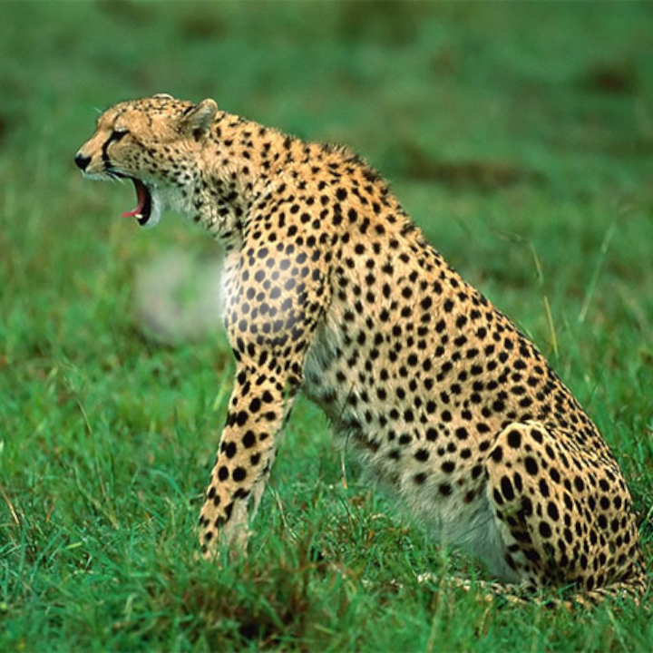
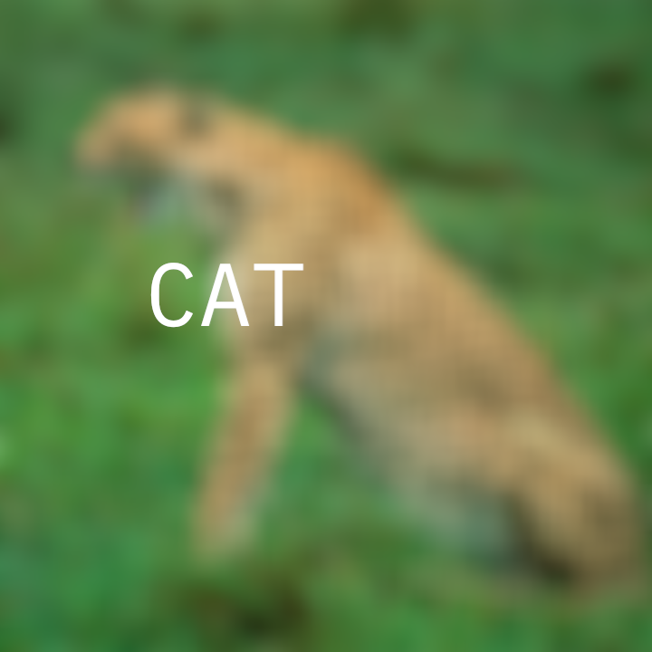
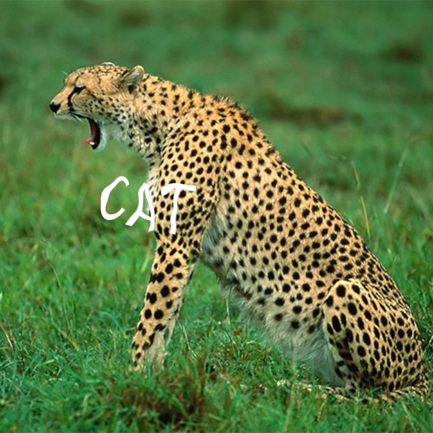

---
# File generated by dokgen. Do not edit. 
# Edit 'src/main/kotlin/docs/60_Compose/C200_Effects.kt' instead.
layout: default
title: Effects
parent: Compose
last_modified_at: 2025.02.20 16:30:45 +0000
nav_order: 200
has_children: false
---
 
# Effects 
 
## Blurred text
 
 
 
 
```kotlin
fun main() = application {
    configure {
        width = 720
        height = 720
    }
    program {
    
        val c = compose {
        
            layer {
                val image = loadImage("data/images/cheeta.jpg")
                draw {
                    drawer.imageFit(image, drawer.bounds)
                }
            }
            // a layer on top of the base layer
            layer {
                val font = loadFont("data/fonts/default.otf", 128.0)
                draw {
                    drawer.fill = ColorRGBa.WHITE
                    drawer.fontMap = font
                    drawer.text("CAT", drawer.bounds.center.x - 200.0, drawer.bounds.center.y)
                }
                // enable effects
                post(ApproximateGaussianBlur()) {
                    window = 25
                    sigma = 15.0
                }
            }
        }
        
        extend {
            c.draw(drawer)
        }
    }
}
``` 
 
[Link to the full example](https://github.com/openrndr/openrndr-examples/blob/master/src/main/kotlin/examples/60_Compose/C200_Effects000.kt) 
 
## Blurred image
 
 
 
 
```kotlin
fun main() = application {
    configure {
        width = 720
        height = 720
    }
    program {
        val c = compose {
        
            layer {
                val image = loadImage("data/images/cheeta.jpg")
                draw {
                    drawer.imageFit(image, drawer.bounds)
                }
                // enable effects
                post(ApproximateGaussianBlur()) {
                    window = 25
                    sigma = 15.0
                }
            }
            // a layer on top of the base layer
            layer {
                val font = loadFont("data/fonts/default.otf", 128.0)
                draw {
                    drawer.fill = ColorRGBa.WHITE
                    drawer.fontMap = font
                    drawer.text("CAT", drawer.bounds.center.x - 200.0, drawer.bounds.center.y)
                }
            }
        }
        
        extend {
            c.draw(drawer)
        }
    }
}
``` 
 
[Link to the full example](https://github.com/openrndr/openrndr-examples/blob/master/src/main/kotlin/examples/60_Compose/C200_Effects001.kt) 
 
## Distorted text
 
 
 
 
```kotlin
fun main() = application {
    configure {
        width = 720
        height = 720
    }
    program {
    
        val c = compose {
        
            layer {
                val image = loadImage("data/images/cheeta.jpg")
                draw {
                    drawer.imageFit(image, drawer.bounds)
                }
            }
            // a layer on top of the base layer
            layer {
                val font = loadFont("data/fonts/default.otf", 128.0)
                draw {
                    drawer.fill = ColorRGBa.WHITE
                    drawer.fontMap = font
                    drawer.text("CAT", drawer.bounds.center.x - 200.0, drawer.bounds.center.y)
                }
                // enable effects
                post(Perturb()) {
                    gain = 0.05
                }
            }
        }
        
        extend {
            c.draw(drawer)
        }
    }
}
``` 
 
[Link to the full example](https://github.com/openrndr/openrndr-examples/blob/master/src/main/kotlin/examples/60_Compose/C200_Effects002.kt) 

[edit on GitHub](https://github.com/openrndr/openrndr-guide/blob/main/src/main/kotlin/docs/60_Compose/C200_Effects.kt){: .btn .btn-github }