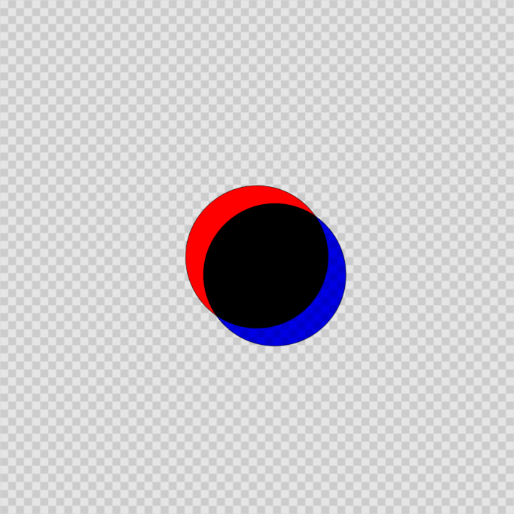

---
# File generated by dokgen. Do not edit. 
# Edit 'src/main/kotlin/docs/60_Compose/C100_LayeredGraphics.kt' instead.
layout: default
title: Layered graphics
parent: Compose
last_modified_at: 2025.02.20 16:30:45 +0000
nav_order: 100
has_children: false
---
 
# Layered graphics in OPENRNDR 
 
## Simple composition
 
 
 
 
```kotlin
fun main() = application {
    configure {
        width = 720
        height = 720
    }
    program {
    
        val c = compose {
            // first layer with a checkers pattern
            layer {
                post(Checkers())
            }
            
            // a base layer
            layer {
                // here we can potentially place initialization code
                draw {
                    drawer.fill = ColorRGBa.RED
                    drawer.circle(drawer.bounds.center, 100.0)
                }
            }
            // a layer on top of the base layer
            layer {
                draw {
                    drawer.fill = ColorRGBa.BLUE
                    drawer.circle(drawer.bounds.center + Vector2(25.0, 25.0), 100.0)
                }
                
                // enable multiply blending for this layer
                blend(Multiply())
            }
        }
        
        extend {
            c.draw(drawer)
        }
    }
}
``` 
 
[Link to the full example](https://github.com/openrndr/openrndr-examples/blob/master/src/main/kotlin/examples/60_Compose/C100_LayeredGraphics000.kt) 

[edit on GitHub](https://github.com/openrndr/openrndr-guide/blob/main/src/main/kotlin/docs/60_Compose/C100_LayeredGraphics.kt){: .btn .btn-github }