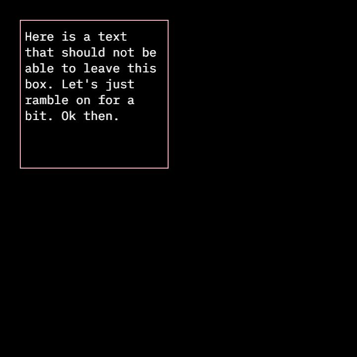
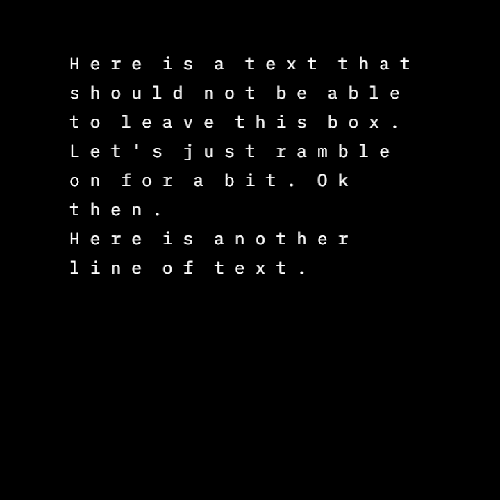
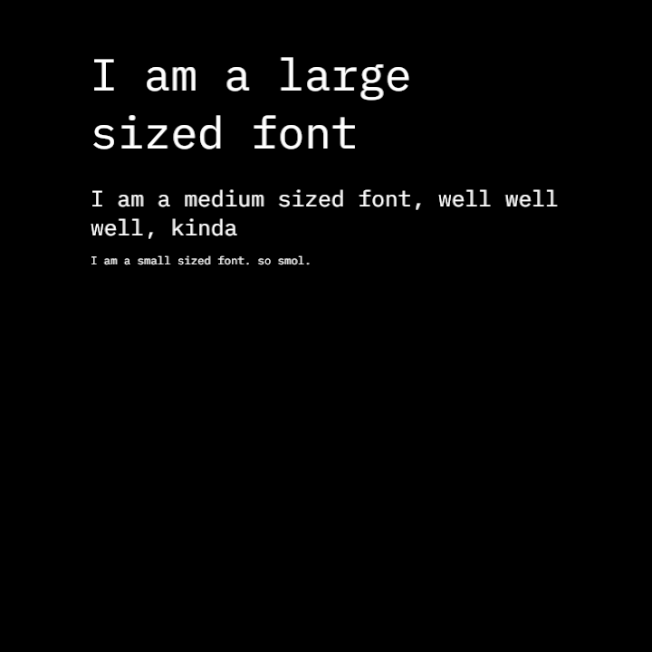

---
# File generated by dokgen. Do not edit. 
# Edit 'src/main/kotlin/docs/30_Typography/C100_Writing.kt' instead.
layout: default
title: Writing
parent: Typography
last_modified_at: 2025.02.20 16:30:45 +0000
nav_order: 100
has_children: false
---
 
# Writing in OPENRNDR 
 
## Text in a box 
 
 
 
```kotlin
fun main() = application {
    configure {
        width = 720
        height = 720
    }
    program {
        extend {
            val r = Rectangle(40.0, 40.0, 300.0, 300.0)
            drawer.fill = null
            drawer.stroke = ColorRGBa.PINK
            
            // preview the rectangle
            drawer.rectangle(r)
            
            drawer.fill = ColorRGBa.WHITE
            
            // set the font
            drawer.fontMap = loadFont("data/fonts/default.otf", 32.0)
            writer {
                // set the box to our previously created rectangle r
                // add some additional margins
                box = r.offsetEdges(-10.0)
                newLine()
                text("Here is a text that should not be able to leave this box. Let's just ramble on for a bit. Ok then.")
            }
        }
    }
}
``` 
 
[Link to the full example](https://github.com/openrndr/openrndr-examples/blob/master/src/main/kotlin/examples/30_Typography/C100_Writing000.kt) 
 
 
 
## Tracking and leading

Tracking controls the horizontal spacing between characters. Leading controls the vertical spacing between lines. 
 
```kotlin
fun main() = application {
    configure {
        width = 720
        height = 720
    }
    program {
        extend {
        
            // set the font
            drawer.fontMap = loadFont("data/fonts/default.otf", 32.0)
            writer {
                // set the box
                box = drawer.bounds.offsetEdges(-100.0)
                leading = 10.0
                tracking = 15.0
                text("Here is a text that should not be able to leave this box. Let's just ramble on for a bit. Ok then.")
                newLine()
                text("Here is another line of text.")
            }
        }
    }
}
``` 
 
[Link to the full example](https://github.com/openrndr/openrndr-examples/blob/master/src/main/kotlin/examples/30_Typography/C100_Writing001.kt) 
 
## Multiple fonts

Tracking controls the horizontal spacing between characters. Leading controls the vertical spacing between lines. 
 
 
 
```kotlin
fun main() = application {
    configure {
        width = 720
        height = 720
    }
    program {
    
        val large = loadFont("data/fonts/default.otf", 64.0)
        val medium = loadFont("data/fonts/default.otf", 32.0)
        val small = loadFont("data/fonts/default.otf", 16.0)
        

        extend {
        
            // set the font
            
            writer {
                // set the box
                box = drawer.bounds.offsetEdges(-100.0)
                drawer.fontMap = large
                text("I am a large sized font")
                newLine()
                
                drawer.fontMap = medium
                text("I am a medium sized font, well well well, kinda")
                newLine()
                
                drawer.fontMap = small
                text("I am a small sized font. so smol.")
                newLine()
            }
        }
    }
}
``` 
 
[Link to the full example](https://github.com/openrndr/openrndr-examples/blob/master/src/main/kotlin/examples/30_Typography/C100_Writing002.kt) 

[edit on GitHub](https://github.com/openrndr/openrndr-guide/blob/main/src/main/kotlin/docs/30_Typography/C100_Writing.kt){: .btn .btn-github }